# homebridge-ecobee3-sensors

[](https://badge.fury.io/js/homebridge-ecobee3-sensors)

[Homebridge](https://github.com/nfarina/homebridge) plugin for exposing wireless temperature and occupancy sensors of your [Ecobee 3 Thermostat](https://www.ecobee.com/ecobee3/) as [HomeKit](https://www.apple.com/ios/home/) accesories. The thermostat itself is a HomeKit accessory, but the sensors are not visible in the [Home app](https://www.apple.com/ios/home/) out of the box. This plugin fixes this problem, so you can have home automation rules based on room occupancy.

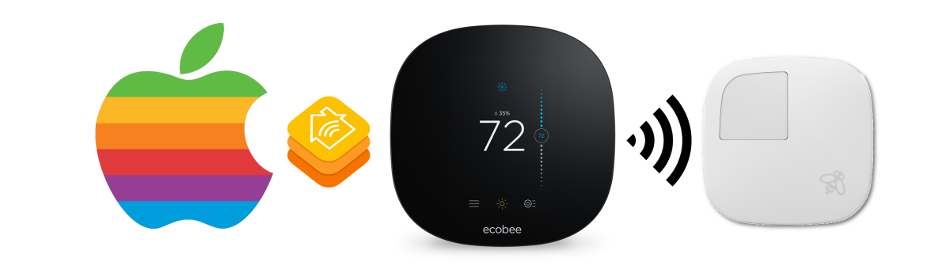

Homebridge runs on top of [Node.js](https://nodejs.org) server and is an open-source implementation of the Apple HomeKit protocol. HomeKit provides the API between your Apple device (i.e. Watch or iPhone) and your home automation server (i.e. Raspberry Pi or Mac Mini). This Homebridge [plugin](https://www.npmjs.com/package/homebridge-ecobee3-sensors) relays the data from [wireless room sensors](https://shop.ecobee.com/products/room-sensors) provided by the [Ecobee API](https://www.ecobee.com/home/developer/api/introduction/index.shtml) and makes them available in HomeKit.


## Installation

Make sure your systems matches the [prerequisites](#what-are-the-prerequisites-for-installation). You need to have a C compiler and [Node.js](https://nodejs.org) server.

### Install Homebridge
[Homebridge](https://github.com/nfarina/homebridge) is a lightweight framework built on top of [Node.js](https://nodejs.org/) server that provides the HomeKit bridge for your Apple devices to connect to.

```sh
[sudo] npm install -g --unsafe-perm homebridge node-gyp
[sudo] npm install -g homebridge-ecobee3-sensors
```

**Note** _Depending on your privileges `-g` flag may need root permissions to install packages to the global `npm` module directory._

### Configure Homebridge
Homebridge is setup via `config.json` file sitting in the `~/.homebridge/` directory. To configure the plugin add a new entry into the platform section and name it whatever you like:

```js
"platforms": [
  {
    "platform": "Ecobee 3 Sensors",
    "name": "Ecobee",
    "exclude_sensors": false,
    "exclude_thermostat": false
  }
]
```

Alternatively, you can use the example [`config.json`](config.json) included in the repository. It's a good starting point and the file doesn't require any modification.

### Run Homebridge
Homebridge package creates a handy executable that can be used to start the home automation server.

```sh
homebridge
```
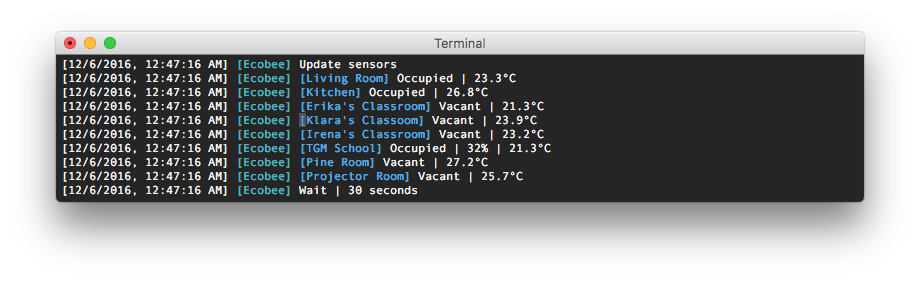


## Authorization

Before you can use the plugin, you have to go through the authorization process which grants it access to your thermostat data.

#### 1. Go to [Ecobee login page](https://www.ecobee.com/home/ecobeeLogin.jsp)

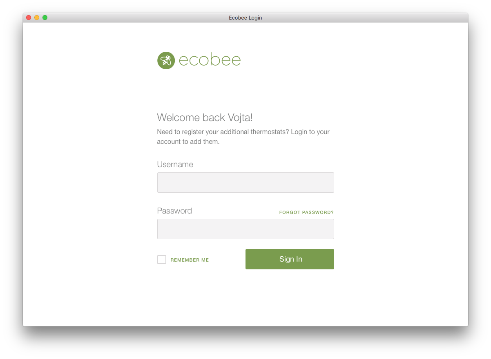

#### 2. Login with your username and password
You need to register your thermostat first, so do this if you haven't yet.

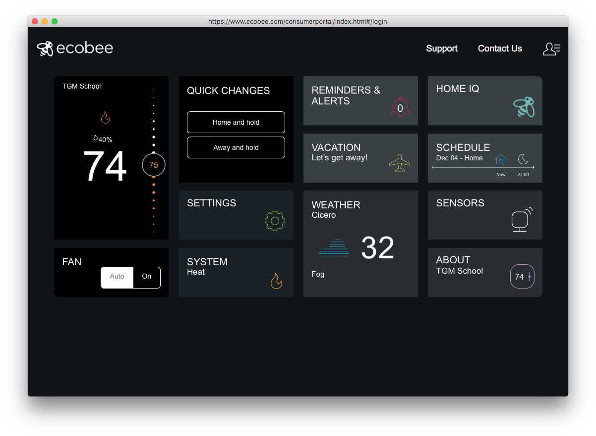

#### 3. Select _MY APPS_ from the menu on the top right.

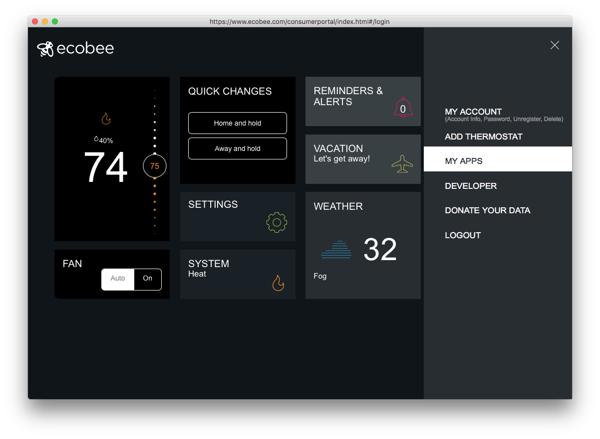

#### 4. Click _Add Application_.

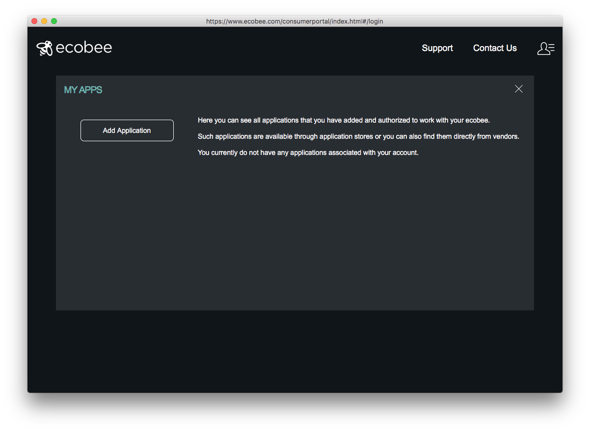

#### 5. Enter the authorization code
The code is shown when _Homebridge_ server starts and this plugin is loaded for the first time.

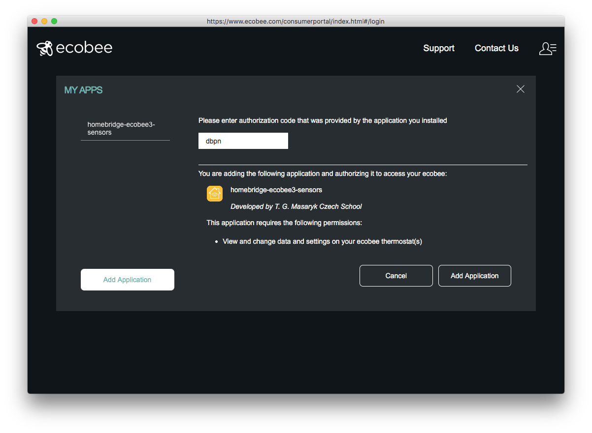
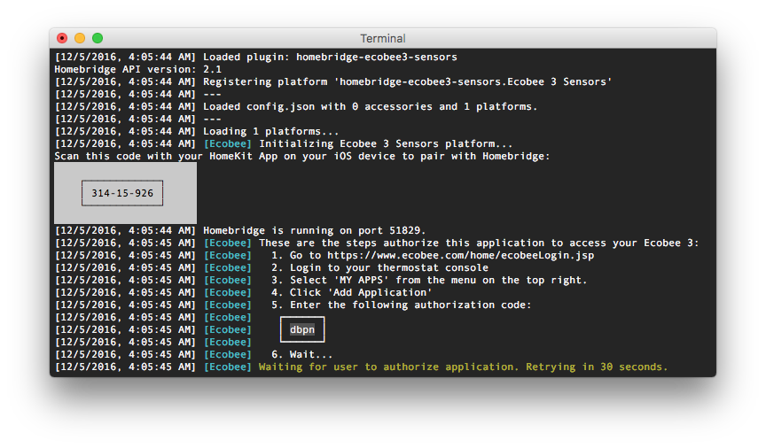

#### 6. Wait a moment...
Ecobee servers are queried every 30 seconds whether the process is completed. Please, be patient. The time delay is a security mechanism of the API to prevent server overload.

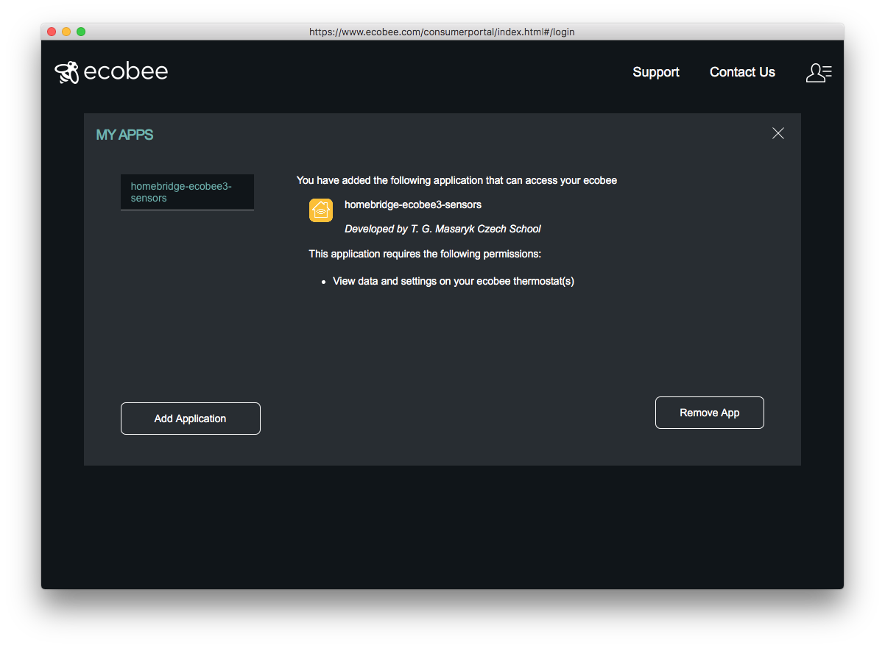
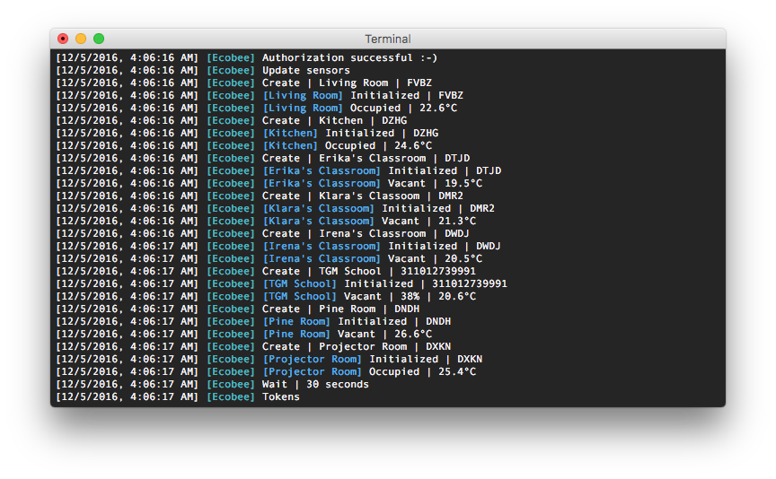

**Note**: The authorization code expires after 10 minutes. If you're not able to complete the process a new code will be generated and the previous code won't be valid anymore.


## Apple Device

### Pairing
Open Home app and tap the '+' button to add new accessory. When you attempt to add your new bridge, it will ask for a "PIN" from the `config.json` file. Once the pairing is completed you will be asked to configure each of your sensors and place it in it's respective room.

### Interacting
Once all of your sensors has been added to the HomeKit database, besides using the Home app or Control Center at the bottom of the screen, you should be able to tell Siri to get reading from the sensors.

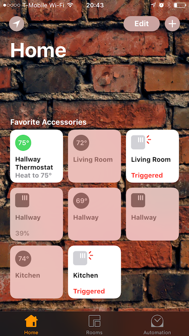
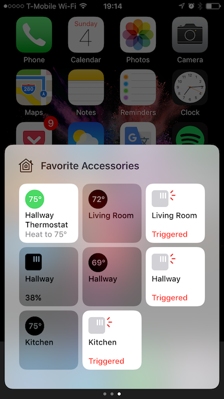
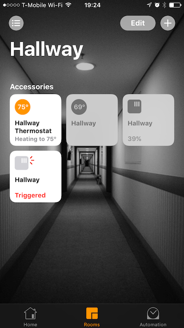

 Try _"Hey Siri, what is the temperature in the Kitchen?"_. or _"Hey Siri, is anyone in the Living Room?"_. HomeKit is a cloud service and iOS may need some time to synchronize your HomeKit database to iCloud and subsequently to all of your devices, so Siri may take a while to start working properly.

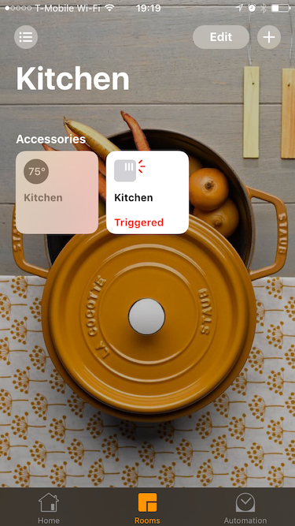
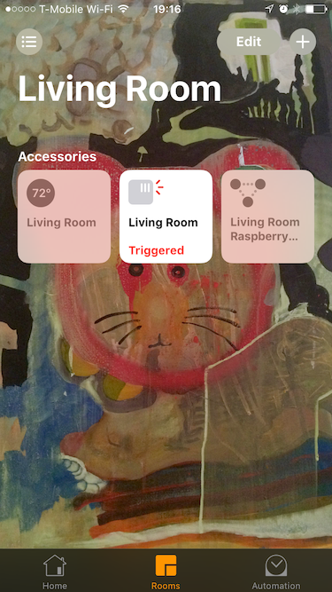
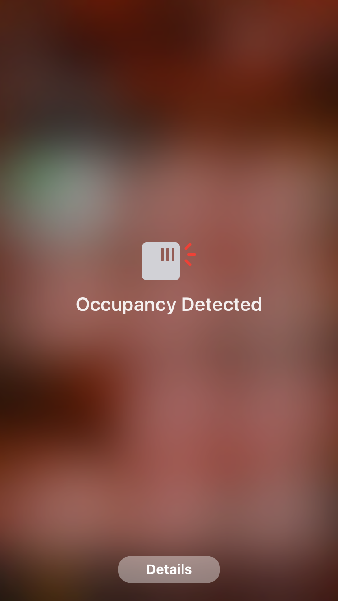


## Advanced User, use own API Key:
To configure the plugin using own API key from ecobee, add a field to config.json file:
```js
"platforms": [
  {
    "platform": "Ecobee 3 Sensors",
    "name": "Ecobee",
    "exclude_thermostat": false,
    "app_key":"Remove this entry if you don't have your Ecobee developer API key."
  }
]
```
To obtain your own api key:
#### 1. Go to [Ecobee login page](https://www.ecobee.com/home/ecobeeLogin.jsp)


#### 2. Login with your username and password
You need to register your thermostat first, so do this if you haven't yet.


#### 3. Select _DEVLOPER_ from the menu on the top right.
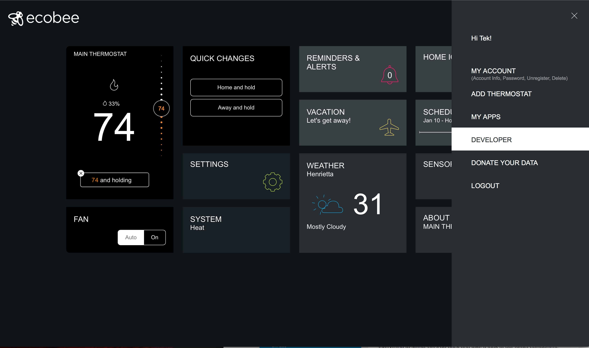

#### 4. Click _CREATE NEW_.

#### 5. Fill in Application Name and Application Summary.
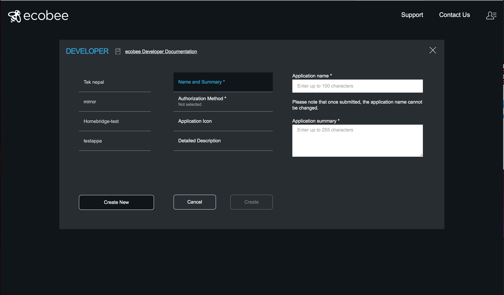

#### 6. Click _Authorization Method_. and select ecobee PIN
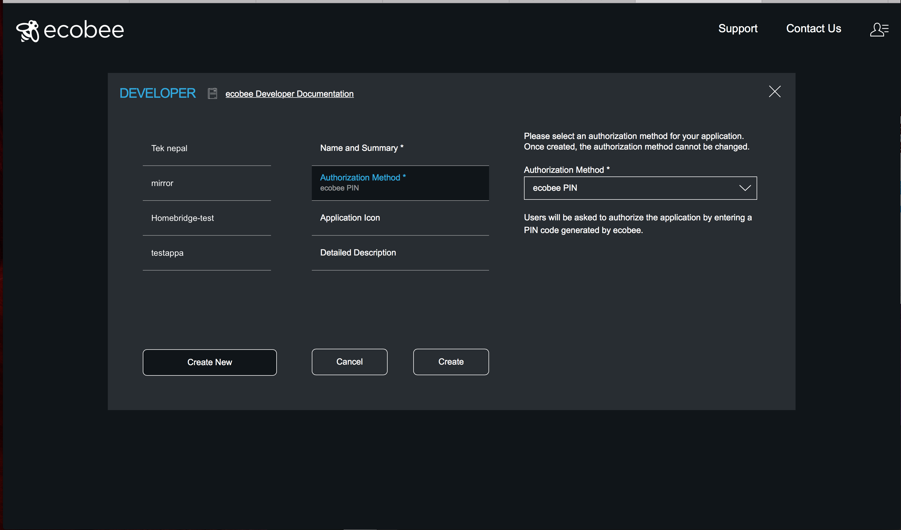

#### 7. Click _CREATE_. and copy your API key.


## Troubleshooting

If you encouter a different problem than something posted below, please, open an [issue](https://github.com/vojtamolda/homebridge-ecobee3-sensors/issues).

### Home app can't discover any nearby accessories
Make sure the Apple device and the Homebridge server are on the same subnet and connected to the same wifi router.

Sometimes, Homebridge server might think that, it has successfully paired with iOS, but iOS doesn't agree. Try to delete the `persist/` directory in the `~/.homebridge/` configuration folder. This removes all pairings that normally persist from session to session.

```sh
rm -rf ~/.homebridge/persist/
```

From time to time it looks like iOS ignores HomeKit bridges with `username` that it has already paired with. Try to change the `username` in the `bridge` section of `config.json` to a new value never used before.


## FAQ

### Can I contribute my own feature?
Sure thing! All contributions are welcome. Just do a pull-request or open a new issue if you see something broken or something that needs improvement.


### How frequently are the sensors updated?
The polling request to get new values of each sensor is scheduled every 30 seconds. However, this may be a bit too frequent since according to the [Ecobee documentation](https://www.ecobee.com/home/developer/api/documentation/v1/operations/get-thermostat-summary.shtml), the shortest sensor update interval is every 3 minutes.


### What are the prerequisites for installation?

#### Linux (Debian Based, Kernel 3.6 or newer)

 - Install [Node.js](https://nodejs.org/en/download/)

   [Node.js](https://nodejs.org) is an asynchronous event driven JavaScript server, ideal for building scalable, low-latency network applications. [Homebridge](https://www.npmjs.com/package/homebridge) is built on top of this server. It is being developed so quickly that package repositories of most distributions contain a very old version. Getting latest from the official website is recommended.

 - Install a C compiler.

#### macOS (10.10 or newer)

 - Install [Node.js](https://nodejs.org/en/download/)

   [Node.js](https://nodejs.org) is an asynchronous event driven JavaScript server, ideal for building scalable, low-latency network applications. [Homebridge](https://www.npmjs.com/package/homebridge) is built on top of this server. It is being developed so quickly that package repositories of most distributions contain a very old version. Getting latest from the official website is recommended.

 - Install [XCode](https://itunes.apple.com/ca/app/xcode/id497799835?mt=12)

   [XCode](https://developer.apple.com/xcode/) comes with a C compiler that is needed to compile the bindings for the _Curve25519_ cypher, which ensures that all HomeKit communication is sercure.

#### Windows (8.1 or newer)
Pull request is welcomed here... [Homebridge](https://www.npmjs.com/package/homebridge) should run on Windows, but I don't have a machine to test.


### Can I access my sensors without this plugin?
Yes. The sensors are visible in the [Ecobee app](https://itunes.apple.com/us/app/ecobee/id916985674?mt=8). They're also accessible by Siri out of the box, although somewhat cumbersomly. See [this link](https://www.ecobee.com/faq/what-voice-commands-can-i-use-to-control-my-homekit-enabled-ecobee3/) for a full list of available commands.


### On what devices was this plugin tested?
Here's a list of testing devices. The list is by no means exhaustive and the plugin will work with many more.
- Apple Device
  - [iPhone](https://en.wikipedia.org/wiki/IPhone) 5S & 6 running [iOS](https://en.wikipedia.org/wiki/IOS) 10

- Homebridge Server
  - [Raspberry Pi](https://en.wikipedia.org/wiki/Raspberry_Pi) 3 & 2 (with USB dongle) running [Raspbian](https://www.raspberrypi.org/downloads/raspbian/)  Jessie Lite
  - [Macbook Air](https://en.wikipedia.org/wiki/MacBook_Air) (2015) & [iMac](https://en.wikipedia.org/wiki/IMac) (2012) running [macOS](https://en.wikipedia.org/wiki/MacOS) 10.12


## License
This work is licensed under the MIT license. See [license](license.txt) for more details.
